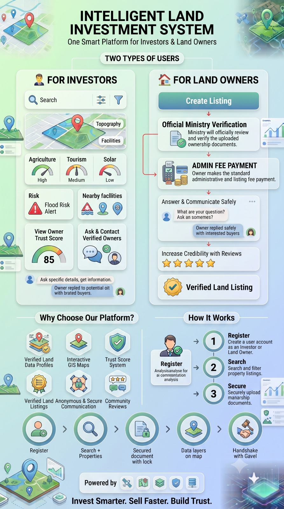

---

# 🌱 Groundwise — Intelligent Land Investment System

> A full-stack platform that digitizes the entire lifecycle of land ownership — from listing and government verification to investor acquisition and secure communication.

---

## 📖 About the Project

**Groundwise** (Intelligent Land Investment System) is a comprehensive university semester project designed to solve a critical issue in modern real estate: **trust**.

In traditional land markets, listings are fragmented, documents are manually reviewed, and buyers have no reliable way to verify legality or geographical viability before investing. Groundwise provides a single, smart platform connecting **Investors**, **Land Owners**, and **Ministry Officials** through a highly secure, verified ecosystem. No listing reaches the public marketplace until it passes strict government verification.

---

## ✨ Core Workflows by Role

### 💼 For Investors

* **Verified Marketplace:** Browse only Ministry-approved, legally clean land listings.
* **Interactive GIS Maps:** View topographical data, nearby facilities, and custom data layers.
* **Intelligent Analysis:** Access AI-driven viability meters for Agriculture, Tourism, and Solar potential, alongside Flood Risk Alerts.
* **Trust Score System:** Evaluate sellers instantly using our proprietary Owner Trust Score (0-100).
* **Secure Communication:** Send direct, trackable inquiries to verified owners and monitor response statuses.

### 🧑‍🌾 For Land Owners

* **Streamlined Submission:** Multi-step wizard to upload property metadata, coordinates, and PDF ownership deeds.
* **Official Ministry Verification:** Track the real-time review status of uploaded documents.
* **Integrated Payments:** Process standard administrative and listing fees securely via Stripe before listings go live.
* **Centralized Inbox:** Receive investor inquiries, reply safely via masked platform tools, and build credibility through community reviews.

### 🏛️ For Ministry (Admins)

* **Pending Queue:** Review incoming listings, verify PDF deeds, and check geographical overlaps.
* **Approval Engine:** Manage the state machine by setting listing statuses to `Pending`, `Approved`, or `Rejected`.
* **System Analytics:** Monitor platform health, user activity, and mitigate fraudulent actors.

---

---

## 🛠️ Full-Stack Architecture & Tech Stack

This project is decoupled into a modern React frontend and a robust Java backend, ensuring scalability and secure role isolation.

### Frontend (Client)

* **Framework:** Next.js 15 (App Router)
* **UI & Styling:** React, Tailwind CSS, Lucide Icons
* **State & Validation:** Zod schemas for data integrity, optimistic UI updates
* **Maps:** Geospatial modules for interactive land viewing

### Backend (Server)

* **Framework:** Spring Boot (Java)
* **Security:** Integrated JWT (JSON Web Tokens) for robust authentication and role-based access control (RBAC).
* **Database:** PostgreSQL (Hosted on Neon) for relational data and state management.
* **Caching:** Redis caching (via Docker) for optimized query performance and fast data retrieval.
* **Storage:** Supabase for secure image and PDF deed storage.
* **Payments:** Stripe API integration featuring secure checkout sessions and automated webhook listeners for real-time listing status updates.

---

## 🚀 Getting Started

Whether you are setting up the client or the server, follow these instructions to run Groundwise locally.

### Prerequisites

* Node.js 18+ (For Frontend)
* Java 17+ & Maven (For Backend)
* Docker (For running Redis locally)

### Frontend Setup

1. **Clone and navigate to the frontend directory:**
```bash
git clone https://github.com/TheFuriousFive/groundwise-frontend.git
cd groundwise-frontend

```


2. **Install dependencies:**
```bash
npm install

```


3. **Environment Variables:** Create a `.env.local` file in the root.
```env
NEXT_PUBLIC_API_URL=http://localhost:8080
# Add any other required frontend keys here

```


4. **Run the development server:**
```bash
npm run dev

```


Open [http://localhost:3000](https://www.google.com/search?q=http://localhost:3000) to view the app.

### Backend Setup

1. **Clone and navigate to the backend directory:**
```bash
git clone https://github.com/TheFuriousFive/groundwise-backend.git
cd groundwise-backend

```


2. **Environment Variables:** Update your `application.properties` or `application.yml` with your local/remote database credentials, Stripe API keys, and Supabase configurations.
3. **Start Redis:**
```bash
docker run --name groundwise-redis -p 6379:6379 -d redis

```


4. **Run the Spring Boot application:**
```bash
mvn spring-boot:run

```


The API will be available at `http://localhost:8080`.

---

## 👨‍💻 The Team (TheFuriousFive)

**Project:** Groundwise Land Management System

**Course:** CS1040 Semester Project

| Index | Name | Role |
| --- | --- | --- |
| 240575F | Rubasingha S.T. (Selith) | Lead Developer / Full-Stack |
| 240370X | Kumarasiri I.D.N. (Nethmika) | Software Engineer |
| 240271U | Jayasekara J.P.D.N.R. (Nadun) | Software Engineer |
| 240297E | Jayawardhana J.A.R.P. (Rashmi) | Software Engineer |
| 240567H | Rathnayake S.U. (Shanuka) | Software Engineer |

---

*Invest Smarter. Sell Faster. Build Trust.*